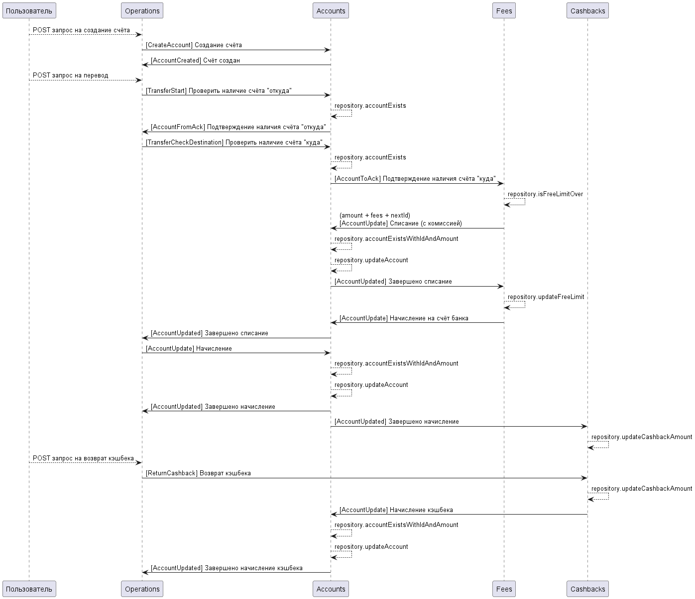

# "Счета и деньги" - проект, реализованный на Scala + Kafka + Docker

Выполнил:
студент группы МИВТ-22-5
**Глазков Никита**

## Функциональные требования

| Требование                                                                                 | Выполнено |
| ------------------------------------------------------------------------------------------ | :-------: |
| Нужно реализовать систему онлайн банка                                                     |    [x]    |
| Пользователи открывают в банке счет                                                        |    [x]    |
| Пользователи пополняют счет                                                                |    [x]    |
| Пользователи делают переводы                                                               |    [x]    |
| Переводы осуществляются с комиссией после превышения определенного лимита на переводы      |    [x]    |
| Банк поощряет переводы по избранным категориям путем начисления кэшбека                    |    [x]    |
| Комиссия начисляется на счет банка\*                                                       |    [x]    |
| Кэшбеки списываются со счета банка и начисляются на счет пользователя, делавшего перевод\* |    [x]    |

## Технические требования

| Требование                                                                                                              | Выполнено |
| ----------------------------------------------------------------------------------------------------------------------- | :-------: |
| Система должна быть распределенной                                                                                      |    [x]    |
| Состоять из микросервисов: счет, операционный сервис, кэшбек и комиссия                                                 |    [x]    |
| Сервис счета должен уметь запускаться в нескольких экземлярах (репликах), при этом каждый реплик обслуживает свои счета |    [x]    |
| Операционный сервис реализует взаимодействие с пользователем по rest api                                                |    [x]    |
| Сервисы взаимодействуют по средствам сообщений (команд и событий)                                                       |    [x]    |
| Сообщения передаются через Apache Kafka                                                                                 |    [x]    |
| Сервисы реализуются на scala                                                                                            |    [x]    |
| Данные в сервисах не хранятся\*                                                                                         |    [x]    |
| Docker-compose                                                                                                          |    [x]    |

## Диаграмма последовательности UML

## Схема домена

